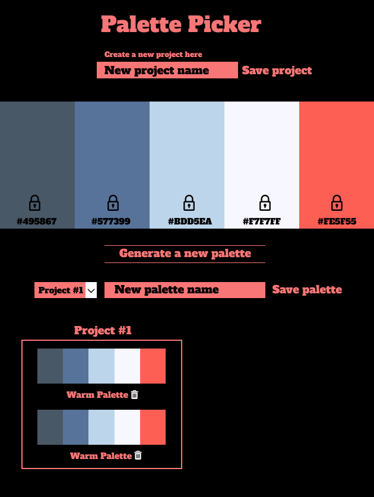

# **Palette Picker**

Palette Picker is a fullstack application built with Node.js, Express and jQuery that allows the user to randomly generate and save color palettes and assign them to projects. This project was designed as a Module 4 solo project at Turing School of Software & Design. My goals were to learn how to recreate the functionality of a popular color picker app, [Coolors](https://coolors.co/) while utilizing a backend database and connecting it to a jquery frontend. 

 
### Installation and Setup Instructions
This app is deployed to Heroku and can be viewed live
[here](https://tmcmeans-palette-picker.herokuapp.com/)

### Lead Developer

Tanj McMeans- [Github](https://github.com/TMcMeans)

### Technologies and Resources

- Node.js
- jQuery
- Express
- Knex
- Postgres
- HTML5
- CSS
- Git 
- Github

### Original Wireframe

### Implementation

